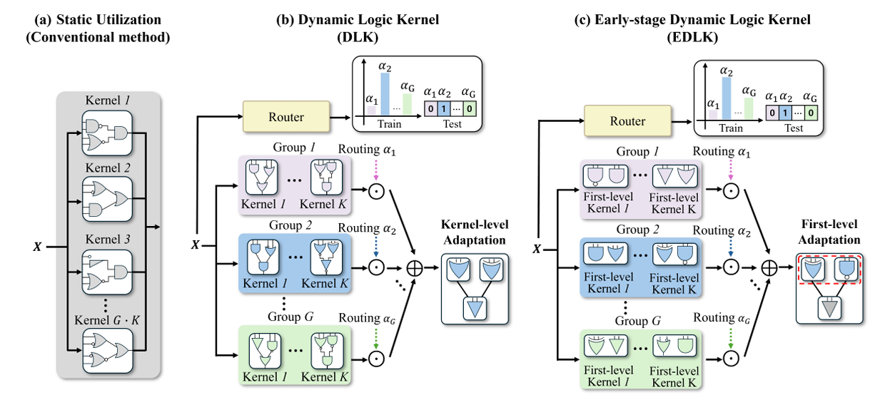

# [NeurIPS'26] Overcoming Kernel Redundancy for Scaling Logic Gate Networks

### Overcoming Kernel Redundancy for Scaling Logic Gate Networks

**Sejin Park**, Hongjae Lee, Changwoo Han, Seung-Won Jung  
Conference on Neural Information Processing Systems (**NeurIPS 2026**)

<p align="center">
  
</p>

## Base Code

> [!NOTE]
> **This project is built upon [LogicIR](https://github.com/jimmy9704/LogicIR), which serves as the base codebase for our implementation.**  

## 🛠️ Environment Setup

For the recommended environment (**PyTorch 2.9.1 + CUDA 12.2**), run:

```bash
conda create -n edlk python=3.10
conda activate edlk
pip install -r requirements.txt
pip install -e . --no-build-isolation
```

The code has also been tested with **PyTorch 1.13.0 + CUDA 11.7**.  
For this configuration, use the CUDA 11.7-specific requirements:

```bash
conda create -n edlk python=3.10
conda activate edlk
pip install -r requirements_cu117.txt
pip install -e . --no-build-isolation
```

For additional installation notes related to `difflogic`, please refer to `INSTALLATION_SUPPORT.md`.

# Pretrained Models

> [!IMPORTANT]
> **Pretrained models will be released soon.**
> 
# Logic Tree Edit Distance

> **Measure structural diversity between learned logic trees.**

We compute the minimum Tree Edit Distance (TED) for every pair of logic trees in the target layer.

- **Mean TED**: average TED across all tree pairs.
- **Normalized Mean TED**: Mean TED divided by the maximum possible TED.

Higher values indicate more diverse logic kernels, while lower values indicate greater redundancy.

```bash
python analyze_logic_ted.py \
  --resume path/to/checkpoint.pt \
  --architecture <architecture> \
  --dataset <dataset> \
  --layer conv3
```


